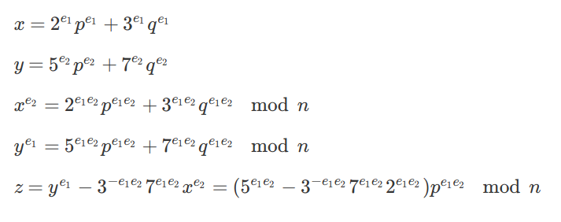

# Infant RSA - 537 points - 19 solves
## RSA challenge with partial information on primes

This was a neat RSA challenge where we receive a ciphertext along with two powers of linear combinations of `p` and `q`. Here are the parameter we get:
```
sage: n
808493201253189889201870335543001135601554189565265515581299663310211777902538379504356224725568544299684762515298676864780234841305269234586977253698801983902702103720999490643296577224887200359679776298145742186594264184012564477263982070542179129719002846743110253588184709450192861516287258530229754571
sage: e1
1761208343503953843502754832483387890309882905016316362547159951176446446095631394250857857055597269706126624665037550324
sage: e2
855093981351105496599755851929196798921968934195328015580099609660702808256223761150292012944728436937787478856194680752
sage: pow(2*p + 3*q, e1, n)
621044266147023849688712506961435765257491308385958611483509212618354776698754113885283380553472029250381909907101400049593093179868197375351718991759160964170206380464029283789532602060341104218687078771319613484987463843848774508968091261333459191715433931164437366476062407396306790590847798240200479849
sage: pow(5*p + 7*q, e2, n)
90998067941541899284683557333640940567809187562555395049596011163797067246907962672557779206183953599317295527901879872677690677734228027852200315412211302749650000923216358820727388855976845209110338837949758874186131529586510244661623437225211502919198181138808456630705718961082655889960517754937606840
sage: pow(m, 65537, n)
350737073191287706245279077094231979383427790754965854345553308198026655242414098616160740809345373227967386631019166444200059217617767145638212921332649998355366471855362243913815961350928202877514312334160636449875324797999398782867956099814177529874805245928396620574131989901122269013123245826472838285
```

The first important observation is that 
```
pow(2*p+3*q, e1, n)=(2*p)**e1 + (3*q)**e2 modulo n,
``` 
and similarly with `e2`. This is because the cross terms are all divisible by `p*q=n`. 

Now the strategy is clear. We need to massage these numbers to end up with a number divisible by `p` (or `q`). Then, taking the gcd with `n` will give `p`. Here is the math:


The number `z` is definitely ugly, but it has the property of being divisible by `p` and not by `q`. Therefore, `gcd(z,n)=p` and we're done!

Here is the python implementation:
```python
from Crypto.Util.number import inverse, long_to_bytes
from math import gcd

n = 808493201253189889201870335543001135601554189565265515581299663310211777902538379504356224725568544299684762515298676864780234841305269234586977253698801983902702103720999490643296577224887200359679776298145742186594264184012564477263982070542179129719002846743110253588184709450192861516287258530229754571
e1 = 1761208343503953843502754832483387890309882905016316362547159951176446446095631394250857857055597269706126624665037550324
e2 = 855093981351105496599755851929196798921968934195328015580099609660702808256223761150292012944728436937787478856194680752
x = 621044266147023849688712506961435765257491308385958611483509212618354776698754113885283380553472029250381909907101400049593093179868197375351718991759160964170206380464029283789532602060341104218687078771319613484987463843848774508968091261333459191715433931164437366476062407396306790590847798240200479849
y = 90998067941541899284683557333640940567809187562555395049596011163797067246907962672557779206183953599317295527901879872677690677734228027852200315412211302749650000923216358820727388855976845209110338837949758874186131529586510244661623437225211502919198181138808456630705718961082655889960517754937606840
c = 350737073191287706245279077094231979383427790754965854345553308198026655242414098616160740809345373227967386631019166444200059217617767145638212921332649998355366471855362243913815961350928202877514312334160636449875324797999398782867956099814177529874805245928396620574131989901122269013123245826472838285

xe2 = pow(x,e2,n)
ye1 = pow(y,e1,n)
z = ye1 - pow(inverse(3,n)*7,e1*e2,n)*xe2
z %= n
p = gcd(z,n)
q = n//p

d = inverse(65537, (p-1)*(q-1))
flag = pow(c, d, n)
print(long_to_bytes(flag))
```
which outputs the flag `sctf{dr4_m1g_b4kl4ng3s}` (along with some padding).
